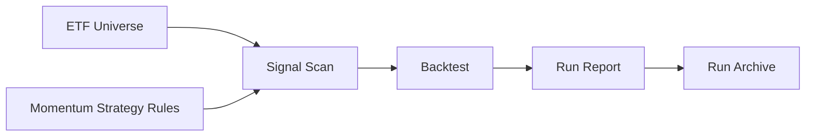

# Momentum Trader

Momentum Trader is a context for a retail investor who wants disciplined A-share ETF momentum trading. The purpose is to scan for rule-based market signals and execute consistently, not to build a leveraged, short-selling, futures, high-frequency, or institutional quant platform.

## Project Definition

Momentum Trader helps a retail investor turn a small set of explicit ETF momentum rules into repeatable scanning, backtesting, and reviewable experiment records.

## Goals

- Scan the A-share ETF market for configured momentum signals.
- Make trading discipline explicit enough that the user can follow rules instead of improvising.
- Compare historical runs and preserve enough context to understand why a result was produced.
- Keep the system understandable for a retail investor operating without institutional execution infrastructure.

## Non-goals

- Do not compete with institutional quantitative trading platforms.
- Do not support leverage, short selling, futures, options, margin trading, or high-frequency execution.
- Do not generate discretionary stock tips or guaranteed buy/sell recommendations.
- Do not hide strategy assumptions behind opaque machine-learning or prediction models.

## High-level Architecture

## Language

**Retail Investor**:
The intended user of the project: an individual investor who needs a disciplined, understandable process rather than institutional trading infrastructure.
_Avoid_: Quant desk, fund manager, professional trader

**A-share ETF**:
An exchange-traded fund accessible through the A-share market and used as the tradable instrument in this project.
_Avoid_: Individual stock, futures contract, leveraged product

**ETF Universe**:
The set of ETFs that the project is allowed to observe for signals and, when rules permit, trade.
_Avoid_: Stock pool, watchlist, recommendation list

**Momentum Strategy**:
A rule-based approach that treats confirmed upward price movement as evidence to enter or continue holding an ETF.
_Avoid_: Prediction model, bottom-fishing strategy, high-frequency strategy

**Signal Scan**:
The act of checking the ETF Universe against strategy rules to find current candidates.
_Avoid_: Stock picking, tip, discretionary call

**Market Signal**:
A rule-derived observation that an ETF currently satisfies a condition the strategy cares about.
_Avoid_: Forecast, prediction, recommendation

**Entry Signal**:
A market condition that makes an ETF eligible for opening a long position under the strategy.
_Avoid_: Buy tip, guaranteed buy point

**Exit Signal**:
A market condition that makes an existing position eligible to be closed under the strategy.
_Avoid_: Sell tip, panic sell

**Intended Position**:
The target exposure assigned to one ETF before staged entry rules are applied.
_Avoid_: All-in position, recommendation size

**Pyramiding**:
A staged increase in exposure after the initial entry as price movement continues to confirm the trend.
_Avoid_: Averaging down, martingale, cost averaging

**Drawdown Stop**:
An exit discipline based on how far price has fallen from the highest price observed during the holding period.
_Avoid_: Profit target, discretionary stop

**Backtest**:
A historical simulation used to understand how a fully specified strategy would have behaved over past market data.
_Avoid_: Live trading result, promise of future return

**Benchmark**:
A comparison series used to put strategy performance in context.
_Avoid_: Target return, guaranteed hurdle

**Run**:
One recorded experiment produced from a specific configuration, data range, and strategy rule set.
_Avoid_: Memory, temporary output

**Run Tag**:
A human-readable label used to identify a Run and compare it with other Runs.
_Avoid_: Branch name, strategy name

**Run Archive**:
A retained record of a Run's outputs so it can be compared with later experiments.
_Avoid_: Latest report, scratch output

**Execution Discipline**:
The user's commitment to follow the configured rules consistently instead of overriding them ad hoc.
_Avoid_: Gut feel, manual timing

**Forward-adjusted Price**:
A price series adjusted so historical prices remain comparable after fund distributions and similar events.
_Avoid_: Raw price, live quote

**Trading Cost**:
The assumed cost charged on each executed side of a trade.
_Avoid_: Tax model, broker statement
