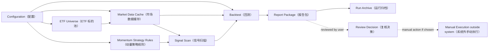

# Momentum Trader

Momentum Trader is a context for a retail investor who wants disciplined A-share ETF momentum trading. The purpose is to scan for rule-based market signals and support manual, disciplined execution in a local-first workflow, not to build a leveraged, short-selling, futures, high-frequency, cloud, or automated trading platform.

## Project Definition

Momentum Trader is a local-first, configuration-driven retail trading system that helps a user turn a small set of explicit ETF momentum rules into repeatable scanning, backtesting, rule explanations, local report packages, manual execution support, and reviewable experiment records.

## Goals

- Scan the A-share ETF market after close for configured momentum signals.
- Make trading discipline explicit enough that the user can manually execute rules instead of improvising.
- Let ordinary experiments be changed through Configuration instead of Python code edits.
- Explain why a rule-based Action Candidate appeared and what the configured rules imply next.
- Compare historical runs against a Benchmark, treating non-lagging return as the primary hurdle and risk metrics as supporting evidence.
- Run locally as a single-user system first, with configuration, cached data, Report Packages, and run archives managed on the user's machine.
- Keep the system understandable for a retail investor operating without institutional execution infrastructure.

## Non-goals

- Do not compete with institutional quantitative trading platforms.
- Do not support leverage, short selling, futures, options, margin trading, or high-frequency execution.
- Do not place real orders or integrate with broker-side automated trading.
- Do not require a cloud service, multi-user platform, hosted signal service, or remote database for the initial system.
- Do not make intraday scanning or real-time execution a default operating mode.
- Do not generate discretionary stock tips or guaranteed buy/sell recommendations.
- Do not present rule outputs as investment advice or remove the user's responsibility to review candidates.
- Do not hide strategy assumptions behind opaque machine-learning or prediction models.
- Do not require Python code changes for ordinary ETF universe, parameter, date-range, cost, or report-label experiments.
- Do not treat automatic all-market ETF discovery as part of the initial ETF Universe concept.
- Do not use Backtest as a parameter-mining tool that optimizes rules until they merely fit historical data.

## High-level Architecture

## Document Scope

This file owns project boundaries, shared language, and the high-level architecture. Module-specific details for data, signal rules, position management, reporting, and operations belong in their own documents or ADRs, so `CONTEXT.md` stays short enough to remain useful.

## Language

The following language is intentionally conceptual. Strategy-parameter, data-source, and position-management details belong in module-specific documents, while this context keeps the shared vocabulary stable.

**Retail Investor（散户）**:
The intended user of the project: an individual investor who needs a disciplined, understandable process rather than institutional trading infrastructure.
_Avoid_: Quant desk, fund manager, professional trader

**Trading System（交易系统）**:
In this project, a rule-based workflow for signal scanning, backtesting, reporting, and manual execution support. The term does not imply broker integration or automated order placement.
_Avoid_: Automated trading platform, institutional quant platform

**Local-first（本地优先）**:
The initial operating model: configuration, cached data, backtest outputs, run archives, and report viewing live on the user's own machine. Cloud deployment can be reconsidered later, but it is not a baseline assumption.
_Avoid_: SaaS platform, hosted signal service, multi-user cloud system

**Configuration-driven（配置驱动）**:
The operating style where ordinary experiments are made by editing configuration, while Python code performs validation, execution, and reporting. Configuration owns ETF universe choices, strategy parameters, date ranges, trading-cost assumptions, and report labels at the concept level.
_Avoid_: Hard-coded experiment, code-only tuning, hidden parameter

**A-share ETF（A 股 ETF）**:
An exchange-traded fund accessible through the A-share market and used as the tradable instrument in this project.
_Avoid_: Individual stock, futures contract, leveraged product

**ETF Universe（ETF 标的池）**:
The manually maintained configuration allowlist of ETFs that the project is allowed to scan and backtest. It is not an automatically discovered all-market ETF pool in the initial system.
_Avoid_: Stock pool, recommendation list, automatic market-wide discovery

**Market Data Source（市场数据源）**:
A replaceable historical daily-data input that provides local-cacheable OHLCV series for Signal Scan and Backtest. It is judged first by reviewability, explainability, and price-semantics consistency rather than by being the newest or fastest feed; it is not the authoritative market record itself and does not promise real-time or broker-grade precision.
_Avoid_: Live quote authority, broker data feed, market data vendor contract

**Formal Market Data Source（正式数据源）**:
The Market Data Source currently trusted for formal Signal Scan and Backtest explanation. It must satisfy the project's price semantics for the instruments being evaluated.
_Avoid_: Fastest feed, temporary fallback, demo feed

**Fallback Market Data Source（备用数据源）**:
One of the configured alternative Market Data Sources used when the Formal Market Data Source is unavailable or being cross-checked. A fallback source may only support formal strategy evaluation when it preserves the same required price semantics.
_Avoid_: Separate truth source, lower-quality formal result, silent substitute

**Market Data Cache（市场数据缓存）**:
The local market-data layer that feeds Signal Scan and Backtest so repeated local runs can be reviewed against the same stored inputs. It is a system boundary, not a promise that the cache is the original market-data authority.
_Avoid_: Live quote stream, external data vendor, remote database

**Market Data Snapshot（市场数据快照）**:
A local market-data input identified by instrument, date range, adjustment, source, and snapshot date. Snapshots from different Market Data Sources are different inputs even when their instrument, date range, and adjustment labels match; a Snapshot exists so a Run can be reviewed against the same stored inputs, not to prove that the data is always the newest possible version.
_Avoid_: Latest data, mutable cache entry, live data view

**Momentum Strategy（动量策略）**:
A rule-based approach that treats confirmed upward price movement as evidence to enter or continue holding an ETF.
_Avoid_: Prediction model, bottom-fishing strategy, high-frequency strategy

**Signal Scan（信号扫描）**:
The act of checking the ETF Universe against strategy rules to find current candidates.
_Avoid_: Stock picking, tip, discretionary call

**After-close Scan（收盘后扫描）**:
A Signal Scan performed after the market close using confirmed daily market data, so the user can review signals before any next-day Manual Execution.
_Avoid_: Intraday scan, real-time alert, high-frequency monitor

**Market Signal（市场信号）**:
A rule-derived observation that an ETF currently satisfies a condition the strategy cares about; it is a fact about rule matching, not an instruction to trade.
_Avoid_: Forecast, prediction, recommendation, trading command

**Signal Condition（信号条件）**:
A single explainable rule predicate that can be evaluated from market data and derived market indicators, such as a breakout, trend filter, momentum threshold, volume threshold, or field-vs-moving-average comparison. It is a component of strategy logic, not a standalone trading instruction and not a holder-state rule.
_Avoid_: Trading signal, recommendation, hidden factor

**Signal Condition Definition（信号条件定义）**:
A reusable definition of one named Signal Condition. Long-term configuration should prefer defining a condition once and referencing it from entry, exit, scan, or report expressions, instead of copying equivalent rule parameters into multiple places with different names.
_Avoid_: Duplicated rule copy, same calculation with different labels, report-only shadow condition

**Signal Input（信号输入）**:
The data a Signal Condition is allowed to read for formal evaluation. Valid inputs are standard market fields with clear observation timing, such as OHLCV, amount, turnover, and Benchmark Series values, plus derived indicators computed by the signal layer from those inputs under the configured rule. Tradable ETF price fields used by formal Signal Conditions share the project's Forward-adjusted Price semantics and should not mix raw and adjusted prices inside one Signal Rule Expression. Arbitrary precomputed factor columns are not formal Signal Inputs unless their source, observation time, and lag semantics are explicit.
_Avoid_: Hidden feature column, unreviewed external factor, future-looking derived data

**Cross-series Signal Input（跨序列信号输入）**:
A Signal Input that compares one instrument or Benchmark Series with another market series. Cross-series inputs are aligned by Signal Observation Time and should not be forward-filled for formal signal evaluation; if the comparison series is unavailable on the observation date, the affected Signal Condition is Unknown.
_Avoid_: Filled comparison value, stale benchmark filter, synthetic relative-strength signal

**Signal Condition Name（信号条件名称）**:
A stable, descriptive label for a Signal Condition's trading intent across Runs. It must be unique across all entry and exit signal conditions within a Strategy Run so reports, CSV columns, and explanations do not merge different rule meanings. It may include parameter hints such as moving-average length, but those hints must not contradict the actual configuration; the mechanical rule expression remains the source of truth for calculation parameters. It should help explain why a condition exists and support report comparison, without replacing the condition's mechanical calculation shape.
_Avoid_: Random identifier, calculation type, natural-language investment advice

**Unknown Condition Result（未知条件结果）**:
A Signal Condition outcome meaning the condition cannot be reliably judged from the available data at the Signal Observation Time. Warmup periods, listing boundaries, missing required inputs on an otherwise valid rule, and unresolved data-quality uncertainty are Unknown rather than False. Unknown should not create an Entry Signal or Exit Signal, and it should remain distinguishable from a condition that was evaluated and found false. Unsupported fields, invalid parameters, and violated data contracts are configuration or data errors, not Unknown results.
_Avoid_: False condition, no-signal proof, silent data sufficiency assumption

**Signal Rule Expression（信号规则表达式）**:
A transparent market-data expression that combines Signal Conditions and can produce an Entry Signal or Exit Signal. It may combine conditions with nested positive AND/OR logic, but it should not rely on NOT-style negation because the project favors explainable rules about what is present, not ambiguous rules about what is absent. Formal evaluation should preserve an explanation for each child condition where practical; if a condition is not evaluated because of short-circuiting, that must be reported as not evaluated rather than False or Unknown.
_Avoid_: Black-box model, ad hoc filter pile, negated rule maze

**Signal Result Matrix（信号结果矩阵）**:
A run artifact that records condition-level results by instrument, signal observation date, and Signal Condition Name. It should preserve True, False, Unknown, and any explicit not-evaluated state so a Report Package can explain why trades or Action Candidates did or did not appear. Its date is the signal date, not the next executable or filled trade date.
_Avoid_: Summary-only signal log, overwritten diagnostic column, untraceable trade trigger

**Signal Diagnostic Value（信号诊断值）**:
A supporting value used to explain a Signal Condition result, such as a breakout threshold, moving average, rolling return, or comparison-series value. Diagnostic values should be associated with the Signal Condition Name that produced them, rather than stored only in global columns that can be overwritten when multiple similar conditions exist.
_Avoid_: Global moving-average column, shared breakout threshold column, overwritten explanation value

**Signal Date（信号日期）**:
The market date whose completed daily bar produced a Market Signal. In the daily after-close workflow, Signal Date is T; any earliest next action belongs to execution metadata, such as T+1 eligibility or actual fill date.
_Avoid_: Execution date, fill date, shifted signal date

**Directional Signal Comparison（方向性信号比较）**:
A Signal Condition comparison that expresses positive evidence with ordered operators such as greater-than, greater-than-or-equal, less-than, or less-than-or-equal. Price and indicator conditions should use directional comparisons; not-equal comparisons are treated as NOT-style negation and should not be used for formal signals. Equality is reserved for explicit discrete market states, not routine price or indicator comparisons.
_Avoid_: Not-equal price rule, absence-as-signal, ambiguous equality trigger

**Signal Applicability Scope（信号适用范围）**:
The review context in which a Signal Rule Expression result is considered, such as entry review or exit review. Applicability that depends on current holdings, portfolio exposure, Pyramiding state, cooldown, or other strategy state belongs to Strategy Execution Filters rather than Signal Conditions.
_Avoid_: Hidden filter, arbitrary state machine, holder-state signal condition

**Strategy Execution Filter（策略执行过滤）**:
A state-aware or universe-aware discipline that combines Market Signal results with current holding, portfolio, staged-entry, cooldown, ranking, capacity, tie-breaking priority, or risk context before an Action Candidate or simulated trade is considered eligible. It is not a Signal Condition because it cannot be evaluated as a standalone market-data predicate for one ETF.
_Avoid_: Market signal, signal condition, pure indicator rule

**Execution Eligibility（执行资格）**:
The execution-layer decision about whether a true Market Signal can become a simulated order or user-facing Action Candidate under next-bar conditions such as suspension, missing open price, limit-up open, cash availability, position slots, or portfolio constraints. Execution ineligibility should not rewrite the underlying Signal Result.
_Avoid_: Signal failure, false entry signal, hidden skipped trade

**Execution Barrier（执行障碍）**:
An execution-layer condition that prevents a Market Signal from becoming a Backtest Fill or Action Candidate even though the underlying signal remains valid. For ETF momentum trading, one-price limit-up opens are treated as rare protective guards rather than a central strategy assumption; more common barriers include missing tradable data, unavailable open price, cash limits, and position-slot limits.
_Avoid_: Signal failure, strategy alpha, price prediction

**Next Eligible Open（下一可执行开盘）**:
The open price of the next Tradable Daily Bar after the Signal Date that passes Execution Eligibility for the intended action. In ordinary continuous trading this is often described as T+1 open, but the formal meaning does not require synthesizing a missing or suspended day.
_Avoid_: Calendar T+1, same-day open, synthetic open

**Multi-instrument Execution（多标的执行）**:
The execution-layer discipline for deciding which same-Signal-Date Entry Signals become Backtest Fills or Action Candidates when portfolio capacity is limited. It ranks already-valid signals and records skipped candidates; it does not create, suppress, or rewrite Market Signals.
_Avoid_: Signal condition, recommendation ranking, silent candidate drop

**Position Slot（持仓槽位）**:
A portfolio-capacity unit that limits how many ETFs a Strategy Run may hold at the same time. Slot limits are Strategy Execution Filters and do not change the underlying Entry Signal result.
_Avoid_: Signal limit, broker account slot, universe size

**Breakout Momentum Score（突破动能分）**:
A selection score used to rank same-Signal-Date Entry Signals competing for limited Position Slots. It measures breakout strength normalized by recent volatility from Signal Date data; a higher score has higher execution priority.
_Avoid_: Parameter-mined alpha score, next-day execution score, discretionary favorite

**Skipped Backtest Fill（跳过回测成交）**:
A backtest record showing that a Market Signal or Action Candidate did not become a Backtest Fill because Execution Eligibility or Position Slot rules blocked it. It should preserve the symbol, relevant selection score when available, and skip reason for auditability.
_Avoid_: Silent drop, false signal, missing order

**Signal Observation Time（信号观察时点）**:
The point at which a Market Signal is considered known. Momentum Trader's first formal signal language is daily and after-close: signals are known only after the relevant Tradable Daily Bar is complete, so same-day OHLCV can be used for after-close review, but next-day or later data cannot be part of that signal. Using T-day open, high, low, close, volume, amount, or turnover in an after-close signal does not imply the strategy could trade at T-day open; execution timing remains a separate rule. Weekly, monthly, or intraday signals require a separate future design rather than implicit reuse of the daily signal semantics.
_Avoid_: Intraday foresight, next-day signal knowledge, future-looking signal, implicit multi-timeframe rule

**Breakout Threshold（突破阈值）**:
The historical price boundary used to decide whether price has broken out. For formal entry logic, the threshold must be formed from completed bars before the bar being evaluated, so the current bar does not help create the level it is trying to break. Current-bar-inclusive breakout calculations may be diagnostic market-state metrics, but they are not formal entry breakout thresholds.
_Avoid_: Current-bar self-reference, intraday high trigger, fitted threshold, self-created breakout

**Tradable Daily Bar（可交易日线）**:
A standardized OHLCV daily record returned by a Market Data Source for an ETF on a date where the project has usable trading data. Missing days are not filled, suspended days are not treated as flat-price days, and dates before an ETF's first available bar are outside that ETF's valid history.
_Avoid_: Filled trading day, synthetic bar, pre-listing placeholder

**Valid History（有效历史）**:
The date range in which an ETF has Tradable Daily Bars inside a Market Data Snapshot. A backtest start date before Valid History is not a Data Gap; the ETF simply cannot participate before its first available Tradable Daily Bar.
_Avoid_: Full backtest range, pre-listing data, synthetic history

**Data Gap（数据缺口）**:
A missing, duplicate, invalid, or price-semantics-inconsistent part of a Market Data Snapshot that cannot be explained by non-trading days, suspension, or an ETF listing boundary. It is a data-quality concern, not an automatic trading signal.
_Avoid_: Suspension day, pre-listing period, no signal

**Data Quality Check（数据质量检查）**:
A review of a Market Data Snapshot that looks for issues that could distort Signal Scan or Backtest interpretation, such as suspicious gaps, duplicate dates, invalid prices, or price-semantics mismatches. It may warn or block strategy evaluation, but it does not create Market Signals.
_Avoid_: Trading signal, data repair, performance filter

**Entry Signal（入场信号）**:
A close-confirmed market condition that makes an ETF eligible for opening a long position under the strategy; it is not a guarantee that the user must place an order. High or low prices may help form thresholds or diagnostics, but first-version formal entry triggers should be based on the completed close unless a future design explicitly introduces intrabar-derived signal semantics.
_Avoid_: Buy tip, guaranteed buy point, buy order, intraday touch trigger

**Exit Signal（出场信号）**:
A close-confirmed market condition that indicates the strategy's exit rule matched. It can be evaluated as a market observation even when the ETF is not currently held, but only Strategy Execution Filters can turn it into a sell-side Action Candidate for an existing position. Path-dependent risk exits are handled outside Signal Conditions. It is not an automated sell instruction.
_Avoid_: Sell tip, panic sell, sell order, sell candidate without a position, intraday touch exit

**Action Candidate（操作候选）**:
A rule-derived item that deserves user review because the configured strategy implies a possible next action. It should include the triggering rule explanation and relevant risk context, but it is not investment advice.
_Avoid_: Recommendation, stock tip, must-trade instruction

**Review Decision（复核决策）**:
The user's recorded decision after reviewing an Action Candidate: execute manually, skip, or defer with a clear reason. It keeps Execution Discipline explicit without forcing mechanical trade placement.
_Avoid_: Silent override, impulsive trade, unrecorded exception

**Intended Position（意向仓位）**:
The planned exposure assigned to one ETF before any staged-entry discipline is considered.
_Avoid_: All-in position, recommendation size

**Pyramiding（金字塔加仓）**:
A staged increase in exposure after an initial entry as price movement continues to confirm the trend.
_Avoid_: Averaging down, martingale, cost averaging

**Drawdown Stop（回撤止损）**:
A state-aware risk-control discipline based on how far price has fallen from the highest price observed during a holding period. Because it depends on holding-path state, it belongs to Strategy Execution Filters or risk-exit rules rather than Signal Conditions.
_Avoid_: Signal condition, profit target, discretionary stop

**Backtest（回测）**:
A historical simulation used to validate rules, compare Runs, and understand how a fully specified strategy would have behaved over past market data. It is not a mandate to mine parameters until they fit history.
_Avoid_: Live trading result, promise of future return, parameter mining

**Backtest Fill（回测成交）**:
A simulated historical fill used inside Backtest when an action passes Execution Eligibility. In the daily after-close model, it uses the Next Eligible Open; it is not Manual Execution or a broker-confirmed real trade.
_Avoid_: Manual execution, real broker fill, signal date

**Benchmark（基准）**:
A baseline market curve used as the historical performance hurdle for a strategy Run. The strategy should not lag its Benchmark on historical return; better risk metrics are useful supporting evidence, but they do not excuse clearly weaker return. The user is willing to accept some volatility in exchange for return.
_Avoid_: Guaranteed future return, absolute profit target, pure low-volatility target

**Benchmark Series（基准序列）**:
A market reference series used to compare a strategy Run against a broad market baseline. It is not a tradable ETF execution-price series and does not inherit Forward-adjusted Price requirements.
_Avoid_: Tradable position, buy-and-hold portfolio, adjusted ETF price series

**Baseline Strategy（基准策略）**:
A simple tradable comparison rule used to judge whether the configured Momentum Strategy is worth doing versus a low-effort ETF alternative, such as buy-and-hold, monthly contribution, or equal-weight holding. It is a comparison strategy, not the user's active Momentum Strategy.
_Avoid_: Benchmark index, live recommendation, optimized strategy

**Run（运行记录）**:
One comparable experiment record produced from a specific configuration, data range, and strategy rule set.
_Avoid_: Memory, temporary output, one-off chart

**Report Package（报告包）**:
The local, reviewable output of a Run, including the HTML report, charts, metric summary, trade details, signal-present rows with condition-level explanations, and configuration snapshot needed to understand the result. Default report views should focus on dates and instruments where Entry Signals, Exit Signals, Action Candidates, skipped executions, or material Unknown results appeared; false-only history should not be shown as a long daily table. A localhost URL is only a viewing method for this local package, not a cloud service.
_Avoid_: Cloud dashboard, hosted report, screenshot-only result, false-only noise wall

**Run Tag（运行标签）**:
A human-readable label used to identify a Run and compare it with other Runs.
_Avoid_: Branch name, strategy name

**Run Archive（运行归档）**:
A retained record of a Run so the user can compare experiments instead of relying on memory or a single attractive backtest.
_Avoid_: Latest report, scratch output

**Execution Discipline（执行纪律）**:
The user's commitment to follow a fixed review process: inspect the rule explanation, record a Review Decision, then execute manually or skip with a reason. It is not blind trading whenever a signal appears.
_Avoid_: Gut feel, manual timing, blind signal following

**Manual Execution（手动执行）**:
The act of the user placing any real trade outside Momentum Trader after reviewing rule-based signals and reports.
_Avoid_: Automated execution, broker integration, algorithmic order placement

**Forward-adjusted Price（前复权价格）**:
A price series adjusted so historical ETF prices remain comparable after fund distributions and similar events. It is the official price meaning for tradable ETF Signal Scan and Backtest in Momentum Trader.
_Avoid_: Raw price, live quote, demonstration-only price

**Trading Cost（交易成本）**:
The assumed cost charged on each executed side of a trade.
_Avoid_: Tax model, broker statement
