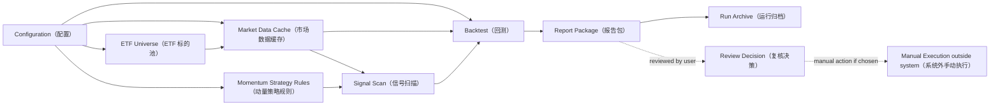

# Momentum Trader

Momentum Trader is a context for a retail investor who wants disciplined A-share ETF momentum trading. The purpose is to scan for rule-based market signals and support manual, disciplined execution in a local-first workflow, not to build a leveraged, short-selling, futures, high-frequency, cloud, or automated trading platform.

## Project Definition

Momentum Trader is a local-first, configuration-driven retail trading system that helps a user turn a small set of explicit ETF momentum rules into repeatable scanning, backtesting, rule explanations, local report packages, manual execution support, and reviewable experiment records.

## Goals

- Scan the A-share ETF market after close for configured momentum signals.
- Make trading discipline explicit enough that the user can manually execute rules instead of improvising.
- Let ordinary experiments be changed through Configuration instead of Python code edits.
- Explain why a rule-based Action Candidate appeared and what the configured rules imply next.
- Compare historical runs against a Benchmark, treating non-lagging return as the primary hurdle and risk metrics as supporting evidence.
- Run locally as a single-user system first, with configuration, cached data, Report Packages, and run archives managed on the user's machine.
- Keep the system understandable for a retail investor operating without institutional execution infrastructure.

## Non-goals

- Do not compete with institutional quantitative trading platforms.
- Do not support leverage, short selling, futures, options, margin trading, or high-frequency execution.
- Do not place real orders or integrate with broker-side automated trading.
- Do not require a cloud service, multi-user platform, hosted signal service, or remote database for the initial system.
- Do not make intraday scanning or real-time execution a default operating mode.
- Do not generate discretionary stock tips or guaranteed buy/sell recommendations.
- Do not present rule outputs as investment advice or remove the user's responsibility to review candidates.
- Do not hide strategy assumptions behind opaque machine-learning or prediction models.
- Do not require Python code changes for ordinary ETF universe, parameter, date-range, cost, or report-label experiments.
- Do not treat automatic all-market ETF discovery as part of the initial ETF Universe concept.
- Do not use Backtest as a parameter-mining tool that optimizes rules until they merely fit historical data.

## High-level Architecture

## Document Scope

This file owns project boundaries, shared language, and the high-level architecture. Module-specific details for data, signal rules, position management, reporting, and operations belong in their own documents or ADRs, so `CONTEXT.md` stays short enough to remain useful.

## Language

The following language is intentionally conceptual. Strategy-parameter, data-source, and position-management details belong in module-specific documents, while this context keeps the shared vocabulary stable.

**Retail Investor（散户）**:
The intended user of the project: an individual investor who needs a disciplined, understandable process rather than institutional trading infrastructure.
_Avoid_: Quant desk, fund manager, professional trader

**Trading System（交易系统）**:
In this project, a rule-based workflow for signal scanning, backtesting, reporting, and manual execution support. The term does not imply broker integration or automated order placement.
_Avoid_: Automated trading platform, institutional quant platform

**Local-first（本地优先）**:
The initial operating model: configuration, cached data, backtest outputs, run archives, and report viewing live on the user's own machine. Cloud deployment can be reconsidered later, but it is not a baseline assumption.
_Avoid_: SaaS platform, hosted signal service, multi-user cloud system

**Configuration-driven（配置驱动）**:
The operating style where ordinary experiments are made by editing configuration, while Python code performs validation, execution, and reporting. Configuration owns ETF universe choices, strategy parameters, date ranges, trading-cost assumptions, and report labels at the concept level.
_Avoid_: Hard-coded experiment, code-only tuning, hidden parameter

**A-share ETF（A 股 ETF）**:
An exchange-traded fund accessible through the A-share market and used as the tradable instrument in this project.
_Avoid_: Individual stock, futures contract, leveraged product

**ETF Universe（ETF 标的池）**:
The manually maintained configuration allowlist of ETFs that the project is allowed to scan and backtest. It is not an automatically discovered all-market ETF pool in the initial system.
_Avoid_: Stock pool, recommendation list, automatic market-wide discovery

**Market Data Source（市场数据源）**:
A replaceable historical daily-data input that provides local-cacheable OHLCV series for Signal Scan and Backtest. It is judged first by reviewability, explainability, and price-semantics consistency rather than by being the newest or fastest feed; it is not the authoritative market record itself and does not promise real-time or broker-grade precision.
_Avoid_: Live quote authority, broker data feed, market data vendor contract

**Formal Market Data Source（正式数据源）**:
The Market Data Source currently trusted for formal Signal Scan and Backtest explanation. It must satisfy the project's price semantics for the instruments being evaluated.
_Avoid_: Fastest feed, temporary fallback, demo feed

**Fallback Market Data Source（备用数据源）**:
One of the configured alternative Market Data Sources used when the Formal Market Data Source is unavailable or being cross-checked. A fallback source may only support formal strategy evaluation when it preserves the same required price semantics.
_Avoid_: Separate truth source, lower-quality formal result, silent substitute

**Market Data Cache（市场数据缓存）**:
The local market-data layer that feeds Signal Scan and Backtest so repeated local runs can be reviewed against the same stored inputs. It is a system boundary, not a promise that the cache is the original market-data authority.
_Avoid_: Live quote stream, external data vendor, remote database

**Market Data Snapshot（市场数据快照）**:
A local market-data input identified by instrument, date range, adjustment, source, and snapshot date. Snapshots from different Market Data Sources are different inputs even when their instrument, date range, and adjustment labels match; a Snapshot exists so a Run can be reviewed against the same stored inputs, not to prove that the data is always the newest possible version.
_Avoid_: Latest data, mutable cache entry, live data view

**Momentum Strategy（动量策略）**:
A rule-based approach that treats confirmed upward price movement as evidence to enter or continue holding an ETF.
_Avoid_: Prediction model, bottom-fishing strategy, high-frequency strategy

**Signal Scan（信号扫描）**:
The act of checking the ETF Universe against strategy rules to find current candidates.
_Avoid_: Stock picking, tip, discretionary call

**After-close Scan（收盘后扫描）**:
A Signal Scan performed after the market close using confirmed daily market data, so the user can review signals before any next-day Manual Execution.
_Avoid_: Intraday scan, real-time alert, high-frequency monitor

**Market Signal（市场信号）**:
A rule-derived observation that an ETF currently satisfies a condition the strategy cares about; it is a fact about rule matching, not an instruction to trade.
_Avoid_: Forecast, prediction, recommendation, trading command

**Tradable Daily Bar（可交易日线）**:
A standardized OHLCV daily record returned by a Market Data Source for an ETF on a date where the project has usable trading data. Missing days are not filled, suspended days are not treated as flat-price days, and dates before an ETF's first available bar are outside that ETF's valid history.
_Avoid_: Filled trading day, synthetic bar, pre-listing placeholder

**Valid History（有效历史）**:
The date range in which an ETF has Tradable Daily Bars inside a Market Data Snapshot. A backtest start date before Valid History is not a Data Gap; the ETF simply cannot participate before its first available Tradable Daily Bar.
_Avoid_: Full backtest range, pre-listing data, synthetic history

**Data Gap（数据缺口）**:
A missing, duplicate, invalid, or price-semantics-inconsistent part of a Market Data Snapshot that cannot be explained by non-trading days, suspension, or an ETF listing boundary. It is a data-quality concern, not an automatic trading signal.
_Avoid_: Suspension day, pre-listing period, no signal

**Data Quality Check（数据质量检查）**:
A review of a Market Data Snapshot that looks for issues that could distort Signal Scan or Backtest interpretation, such as suspicious gaps, duplicate dates, invalid prices, or price-semantics mismatches. It may warn or block strategy evaluation, but it does not create Market Signals.
_Avoid_: Trading signal, data repair, performance filter

**Entry Signal（入场信号）**:
A market condition that makes an ETF eligible for opening a long position under the strategy; it is not a guarantee that the user must place an order.
_Avoid_: Buy tip, guaranteed buy point, buy order

**Exit Signal（出场信号）**:
A market condition that makes an existing position eligible to be closed under the strategy; it is not an automated sell instruction.
_Avoid_: Sell tip, panic sell, sell order

**Action Candidate（操作候选）**:
A rule-derived item that deserves user review because the configured strategy implies a possible next action. It should include the triggering rule explanation and relevant risk context, but it is not investment advice.
_Avoid_: Recommendation, stock tip, must-trade instruction

**Review Decision（复核决策）**:
The user's recorded decision after reviewing an Action Candidate: execute manually, skip, or defer with a clear reason. It keeps Execution Discipline explicit without forcing mechanical trade placement.
_Avoid_: Silent override, impulsive trade, unrecorded exception

**Intended Position（意向仓位）**:
The planned exposure assigned to one ETF before any staged-entry discipline is considered.
_Avoid_: All-in position, recommendation size

**Pyramiding（金字塔加仓）**:
A staged increase in exposure after an initial entry as price movement continues to confirm the trend.
_Avoid_: Averaging down, martingale, cost averaging

**Drawdown Stop（回撤止损）**:
A risk-control discipline based on how far price has fallen from the highest price observed during a holding period.
_Avoid_: Profit target, discretionary stop

**Backtest（回测）**:
A historical simulation used to validate rules, compare Runs, and understand how a fully specified strategy would have behaved over past market data. It is not a mandate to mine parameters until they fit history.
_Avoid_: Live trading result, promise of future return, parameter mining

**Benchmark（基准）**:
A baseline market curve used as the historical performance hurdle for a strategy Run. The strategy should not lag its Benchmark on historical return; better risk metrics are useful supporting evidence, but they do not excuse clearly weaker return. The user is willing to accept some volatility in exchange for return.
_Avoid_: Guaranteed future return, absolute profit target, pure low-volatility target

**Benchmark Series（基准序列）**:
A market reference series used to compare a strategy Run against a broad market baseline. It is not a tradable ETF execution-price series and does not inherit Forward-adjusted Price requirements.
_Avoid_: Tradable position, buy-and-hold portfolio, adjusted ETF price series

**Baseline Strategy（基准策略）**:
A simple tradable comparison rule used to judge whether the configured Momentum Strategy is worth doing versus a low-effort ETF alternative, such as buy-and-hold, monthly contribution, or equal-weight holding. It is a comparison strategy, not the user's active Momentum Strategy.
_Avoid_: Benchmark index, live recommendation, optimized strategy

**Run（运行记录）**:
One comparable experiment record produced from a specific configuration, data range, and strategy rule set.
_Avoid_: Memory, temporary output, one-off chart

**Report Package（报告包）**:
The local, reviewable output of a Run, including the HTML report, charts, metric summary, trade details, and configuration snapshot needed to understand the result. A localhost URL is only a viewing method for this local package, not a cloud service.
_Avoid_: Cloud dashboard, hosted report, screenshot-only result

**Run Tag（运行标签）**:
A human-readable label used to identify a Run and compare it with other Runs.
_Avoid_: Branch name, strategy name

**Run Archive（运行归档）**:
A retained record of a Run so the user can compare experiments instead of relying on memory or a single attractive backtest.
_Avoid_: Latest report, scratch output

**Execution Discipline（执行纪律）**:
The user's commitment to follow a fixed review process: inspect the rule explanation, record a Review Decision, then execute manually or skip with a reason. It is not blind trading whenever a signal appears.
_Avoid_: Gut feel, manual timing, blind signal following

**Manual Execution（手动执行）**:
The act of the user placing any real trade outside Momentum Trader after reviewing rule-based signals and reports.
_Avoid_: Automated execution, broker integration, algorithmic order placement

**Forward-adjusted Price（前复权价格）**:
A price series adjusted so historical ETF prices remain comparable after fund distributions and similar events. It is the official price meaning for tradable ETF Signal Scan and Backtest in Momentum Trader.
_Avoid_: Raw price, live quote, demonstration-only price

**Trading Cost（交易成本）**:
The assumed cost charged on each executed side of a trade.
_Avoid_: Tax model, broker statement
